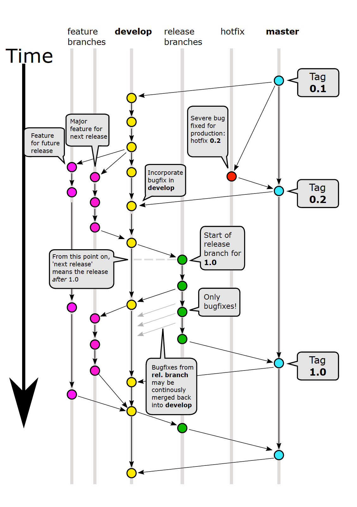

Committers
============

<!-- TOC -->

- [Branch Targeting](#branch-targeting)
- [Summary](#summary)
- [Terminology](#terminology)
- [Review Process](#review-process)
    - [Receive new PR (pull request)](#receive-new-pr-pull-request)
    - [Initial PR Review](#initial-pr-review)
    - [Review the Code](#review-the-code)
    - [Accepting a PR](#accepting-a-pr)
- [Merging](#merging)
  - [Pull Request Retargeting](#pull-request-retargeting)

<!-- /TOC -->

## Branching Strategy

This repository uses the following branching strategy:



Depending on where your fix/enhancement goes, please target the proper branch. Community members always target develop, but committers should know where the fix they are presenting goes. It makes it much easier to push the shiny green button on a pull request. If you are not sure where to target, ask.

### Features

#### Creating a feature branch

```bash
git checkout -b myfeature develop
```

#### Finishing a feature branch

```bash
git checkout develop
git merge --no-ff myfeature
git branch -d myfeature
git push origin --delete myfeature # if feature branch pushed to fork repository
git push upstream develop
git push origin develop
```

### Releases

#### Creating a release branch

```bash
git checkout -b release/0.2.0 develop
```

#### Finishing a release branch

```bash
git checkout master
git merge --no-ff release/0.2.0
git tag -a 0.2.0 -m "version 0.2.0"
git checkout develop
git merge master
git branch -d release/0.2.0
git push upstream --delete release/0.2.0 # if release branch pushed to main repository
git push upstream master
git push upstream develop
git push origin master
git push origin develop
```

### Hotfixes

#### Creating a hotfix branch

```bash
git checkout -b hotfix/0.1.1 master
```

#### Finishing a hotfix branch

```bash
git checkout master
git merge --no-ff hotfix/0.1.1
git tag -a 0.1.1 -m "version 0.1.1"
git checkout develop
git merge master
git branch -d hotfix/0.1.1
git push upstream --delete hotfix/0.1.1 # if hotfix branch pushed to main repository
git push upstream master
git push upstream develop
git push origin master
git push origin develop
```

## Summary
We like to see folks contributing to Chocolatey. If you are a committer, we'd like to see you help from time to time with triage and the pull request process.

In all cases politeness goes a long way. Please thank folks for contributions - they are going out of their way to help make the code base better, or adding something they may personally feel is necessary for the code base.

Please be VERY familiar with [CONTRIBUTING](https://github.com/chocolatey/choco/blob/develop/CONTRIBUTING.md) and follow the process as well.

## Terminology
**Contributor** - A person who makes a change to the code base and submits a change set in the form of a pull request.

**Change Set** - A set of discrete commits which combined together form a contribution.  A change set takes the form of git commits and is submitted in the form of a pull request. Used interchangeably with "pull request".

**Committer** - A person responsible for reviewing a pull request and then making the decision what base branch to merge the change set into.

## Review Process
#### Receive new PR (pull request)
 * A contributor sends a pull request (usually against develop).
 * A committer typically reviews it within a week or less to determine the feasibility of the changes.

#### Initial PR Review
 * Has the user signed the Contributor License Agreement (CLA)?
 * Did the user create a branch with these changes? If it is on their default branch (i.e. develop), please ask them to review [CONTRIBUTING](https://github.com/chocolatey/choco/blob/develop/CONTRIBUTING.md).
 * Did the user reformat files and they should not have? Was is just white-space? You can try adding [?w=1](https://github.com/blog/967-github-secrets) to the URL on GitHub.
 * Are there tests? We really want any new contributions to contain tests so unless the committer believes this code really needs to be in the code base and is willing to write the tests, then we need to ask the contributor to make a good faith effort in adding test cases. Ask them to review the [contributing document](https://github.com/chocolatey/choco/blob/develop/CONTRIBUTING.md) and provide tests. **Note:** Some commits may be refactoring which wouldn't necessarily add additional test sets.
 * Is the code documented properly? Does this additional set of changes require changes to the [documentation](https://docs.chocolatey.org)?
 * Was this code warranted? Did the contributor follow the process of gaining approval for big change sets? If not please have them review the [contributing document](https://github.com/chocolatey/choco/blob/develop/CONTRIBUTING.md) and ask that they follow up with a case for putting the code into the code base on the mailing list.

#### Review the Code
  * Does the code meet the naming conventions and formatting (need link)?
  * Is the code sound? Does it read well? Can you understand what it is doing without having to execute it? Principal of no clever hacks (need link).
  * Does the code do what the purpose of the pull request is for (and only that)?

#### Accepting a PR
Once you have reviewed the initial items, and are not waiting for additional feedback or work by the contributor, give the thumbs up that it is ready for the next part of the process (merging).

Unless there is something wrong with the code, we don't ask contributors to rebase against develop. They did the work to create the patch in the first place, asking them to unnecessarily come back and try to keep their code synced up with develop is not an acceptable process.

## Merging
Once you have reviewed the change set and determined it is ready for merge, the next steps are to bring it local and evaluate the code further by actually working with it, running the tests locally and adding any additional commits or fix-ups that are necessary in a local branch.

When merging the user's contribution, it should be done with `git merge --log --no-ff` to create a merge commit so that in case there is an issue it becomes easier to revert later, and so that we can see where the code came from should we ever need to go find it later (more information on this can be found [here](https://www.kernel.org/pub/software/scm/git/docs/git-merge.html) and also a discussion on why this is a good idea [here](https://web.archive.org/web/20190529002804/https://differential.com/insights/best-way-to-merge-a-github-pull-request/)).

### Pull Request Retargeting
Because we ask contributors to target develop, sometimes a fix/enhancement may need to be retargeted to a hotfix, or release, branch. This process is somewhat easy thanks to git. In most cases you won't even need to ask the user to do this for you.

 * `git fetch upstream pull/<github_pull_id>/head:pr<github_pull_id>` - `upstream` is `git@github.com:chocolatey/choco.git`
 * `git checkout pr<github_pull_id>`
 * `git rebase --onto hotfix/0.2.2 develop` - this uses the local branch, starts with latest hotfix/0.2.2 and reapplies the commits from the branch to it, removing all commits that were only on the develop.  **NOTE:** This is just an example, you should use the name of the hotfix/release branch that is currently being used.
 * `build.bat` - build and test
 * Any additional changes or testing here.
 * `git checkout hotfix/0.2.2`
 * `git fetch upstream` - if this pulls anything, make sure to also run `git rebase upstream/hotfix/0.22` prior to merging or you will lose the merge commit.
 * `git merge pr<github_pull_id> --log --no-ff`
 * `git branch -d pr<github_pull_id>`
 * Make any last checks to ensure the git logs look good. The next step sets the commits in stone and unable to be changed.
 * `git push upstream`

References

 * [http://pivotallabs.com/git-rebase-onto/ (Archive)](https://web.archive.org/web/20150709101404/http://pivotallabs.com:80/git-rebase-onto/)
 * http://git-scm.com/book/ch3-6.html
